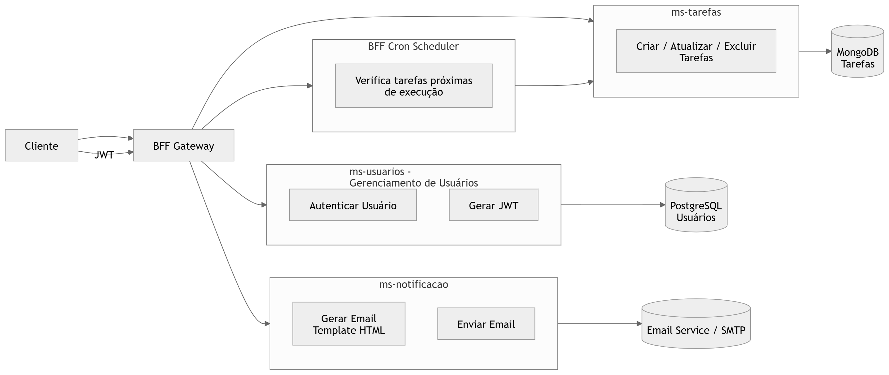

# Microserviço de Notificação (ms-notificacao)

---

### Contexto do Projeto

O **ms-notificacao** é uma API REST desenvolvida em **Java com Spring Boot** e faz parte do projeto **Agendador de Tarefas**, construído com base em arquitetura de microserviços.

**Este microserviço é responsável por:** 

- Processar notificações de tarefas
- Gerar conteúdo de e-mails a partir de templates HTML
- Enviar notificações para os usuários
- Gerenciar o status das notificações

O serviço recebe requisições principalmente do **BFF**, que executa um **cron scheduler** responsável por identificar tarefas próximas e disparar notificações automaticamente.

O microserviço está **dockerizado**, permitindo execução isolada, portabilidade e integração rápida com o ecossistema de microserviços.

---

### Arquitetura do Sistema

O sistema **Agendador de Tarefas** é composto por múltiplos microserviços especializados que trabalham de forma independente.

O **ms-notificacao** é responsável exclusivamente pelo envio de notificações por e-mail.

#### Diagrama da Arquitetura

  

**Descrição do fluxo**

1. O cliente realiza autenticação através do **ms-usuarios**.
2. O **ms-usuarios** gera um token JWT.
3. O cliente envia requisições autenticadas para o **BFF**.
4. O BFF executa um **cron scheduler** responsável por verificar tarefas agendadas.
5. O BFF consulta o **ms-tarefas** para identificar tarefas próximas do horário de execução.
6. Para cada tarefa identificada, o **BFF chama o ms-notificacao**.
7. O **ms-notificacao** gera o conteúdo do e-mail utilizando **Thymeleaf**.
8. O serviço envia o e-mail através do **JavaMailSender**.

**Benefícios dessa arquitetura:**

- Separação clara de responsabilidades
- Segurança centralizada
- Escalabilidade independente
- Organização modular da aplicação

---

#### Integração com OpenFeign

A comunicação entre os microserviços da arquitetura ocorre através do **Spring Cloud OpenFeign**.

O **BFF** utiliza OpenFeign para realizar chamadas HTTP declarativas para o **ms-notificacao**, permitindo o envio de notificações quando tarefas precisam gerar alertas para os usuários.

**Essa abordagem garante:**

- Redução de código boilerplate
- Padronização de chamadas HTTP entre microserviços
- Facilidade na manutenção de endpoints remotos
- Comunicação eficiente entre o **BFF** e o **ms-notificacao**

Dessa forma, o **ms-notificacao** permanece responsável apenas pelo processamento e envio das notificações, mantendo baixo acoplamento com os demais serviços da arquitetura.

---

### Segurança

Apenas usuários autenticados podem **criar e gerenciar tarefas** no **ms-tarefas**.

Posteriormente, o **BFF** pode acionar o **ms-notificacao** para enviar notificações relacionadas a essas tarefas.

**Essa abordagem garante:**

- Comunicação segura entre microserviços
- Controle de acesso
- Autenticação centralizada

---

### Observabilidade

O microserviço utiliza **Spring Boot Actuator** para monitoramento e exposição de métricas operacionais.

**Endpoints disponíveis:**

- Healthcheck da aplicação
- Monitoramento de disponibilidade
- Informações da aplicação
- Métricas operacionais

**Exemplo de endpoint:**

    http://localhost:8082/actuator/health

A utilização do Actuator permite acompanhar a saúde do serviço dentro da arquitetura distribuída.

---

### API REST

O **ms-notificacao** expõe endpoints REST **stateless**:

- Método HTTP: POST
- Representação de recursos em JSON
- Comunicação HTTP dentro da arquitetura distribuída

**Endpoint principal:**

| Método | Endpoint | Descrição |
|------|------|------|
| POST | /email | Enviar notificação por e-mail |

---

### Documentação da API

A documentação da API está disponível via **Swagger:**

    http://localhost:8082/swagger-ui.html

---

### Tecnologias Utilizadas

- Java 17
- Spring Boot
- Spring Web
- Spring Mail
- Thymeleaf
- Spring Actuator
- Gradle
- Docker

---

### Execução do Projeto

**Gradle**

    ./gradlew bootRun

**Docker**

    docker build -t notificacao-api .

    docker run -p 8082:8082 notificacao-api

---

### Benefícios Arquiteturais

- Separação clara de responsabilidades
- Serviço dedicado ao envio de notificações
- Templates de e-mail dinâmicos com Thymeleaf
- Integração com outros microserviços
- Escalabilidade independente
- Containerização com Docker
- Observabilidade integrada via Actuator
- Arquitetura modular baseada em microserviços

---

### Melhorias Futuras

- Implementar mensageria (RabbitMQ ou Kafka)
- Retry automático para falhas de envio
- Estratégias de resiliência
- Implementação de testes automatizados (unitários e de integração)
- Deploy em ambiente Cloud

---

### Autor

**Geisivan Vitena**

LinkedIn:  
https://www.linkedin.com/in/geisivan-vitena-a46168246/
